<div align="center">

<!-- Header: starry night background via capsule-render -->



<br/>


&nbsp;&nbsp;


</div>

---

```yaml
❯ whoami

  name:       Lev Anisimov
  alias:      AcridGold
  location:   Novosibirsk, Russia 🇷🇺
  contacts:
    email:    acridgold@ya.ru
    tg:       t.me/acridgold
    github:   github.com/AcridGold
  uni:        NSU FIT — Computer Science & Engineering
  roles:
    - 🧪  QA Engineer (SHIFT Lab, 2026–present)
    - 🔧  Backend Developer
    - 🎤  Event Organizer / Media
  english:    C1
  vibe:       chill + beer 🍺
```

---

<div align="center">

### 🛠 Stack

**· Languages ·**


**· Backend & DB ·**


**· QA & Testing ·**


**· Infra & Tools ·**


---

### 📬 Contact

[](https://vk.com/acridgold)
[](https://t.me/acridgold)
[](mailto:acridgold@ya.ru)
[](https://linkedin.com/in/acridgold)

</div>

---

## 💼 Experience

**🔬 SHIFT Lab** `2026 — present` — QA Engineer
> Manual & automated testing. Found **10+ critical bugs** in the first month.

**🏦 Sberbank** `2025 — 2026` — Campus Ambassador at NSU
> Organized events for up to **500 people**, promoting company products to the student audience.

**🎓 NSU FIT** `2025 — 2026` — Lab Assistant
> Development of internal faculty systems.

---

## 🏆 Hackathons

**🌐 [Hackathon "Learning Visualization in Global ERP" — STIK](https://github.com/AcridGold)** `2026`
> Team Lead, DevOps, QA Engineer. LMS platform with planning, financial accounting and progress monitoring modules.
> `Python` `JS` `Railway` `Docker`

**⚔️ [Hackathon "System Hack: Novosibirsk"](https://github.com/AcridGold)** `2025`
> Team Lead + Lead Front-end Developer. AI-based system for preventing employee burnout.
> `JS` `React` `Vite`

---

<div align="center">

### 📊 GitHub Stats

<a href="https://github.com/AcridGold">
  
</a>
<a href="https://github.com/AcridGold">
  
</a>

---

### 🔥 Streak

[](https://git.io/streak-stats)

---


</div>


